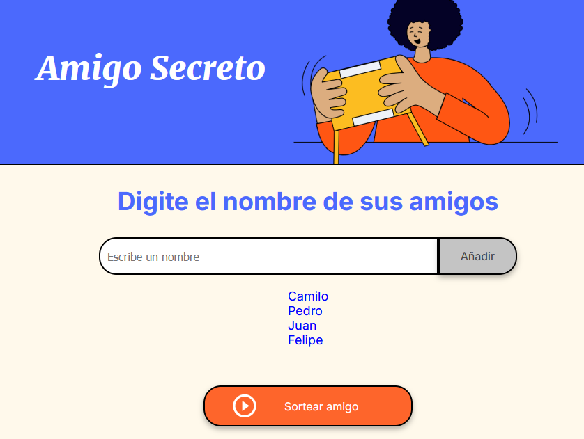
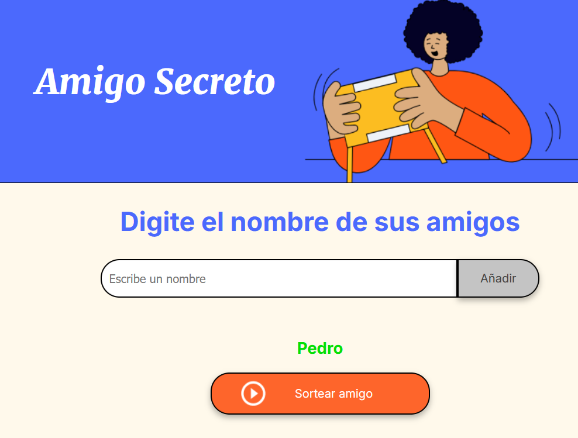

# 🎁 Amigo Secreto

Este proyecto es una aplicación web que permite gestionar una lista de amigos y realizar un sorteo de Amigo Secreto de manera sencilla.

## 📌 Descripción
La aplicación solicita una lista de amigos, la muestra en pantalla y permite realizar un sorteo aleatorio para asignar a cada participante su Amigo Secreto.

# Lista de amigos:

# Resultado del sorteo:

## 🚀 Cómo usar
1. Ingresa los nombres de los participantes.
2. Visualiza la lista de amigos ingresados.
3. Realiza el sorteo con un botón.
4. Descubre a quién te tocó como Amigo Secreto.

## 🛠 Tecnologías utilizadas
- HTML
- CSS
- JavaScript

## 📌 Autor
**Jonathan Duarte**

¡Disfruta del juego y diviértete con tus amigos! 🎉
